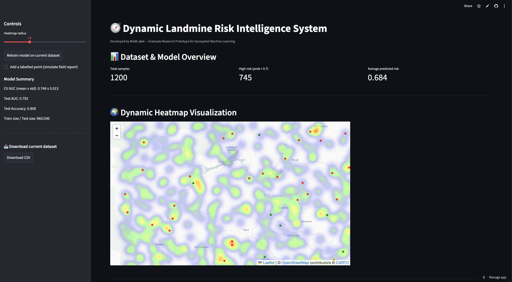
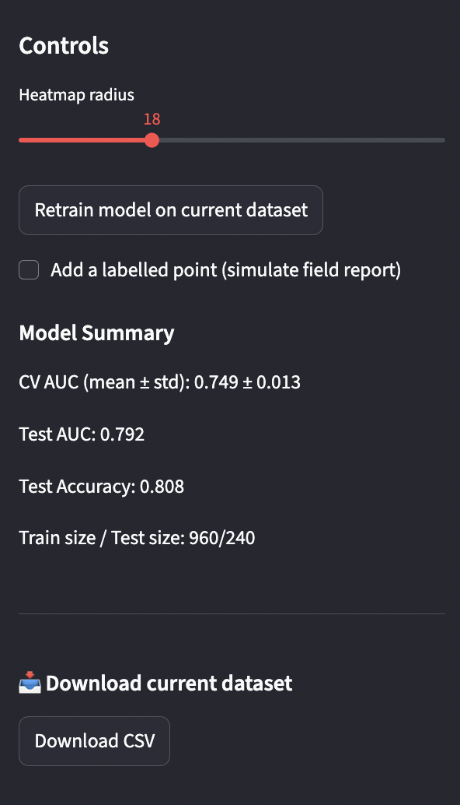
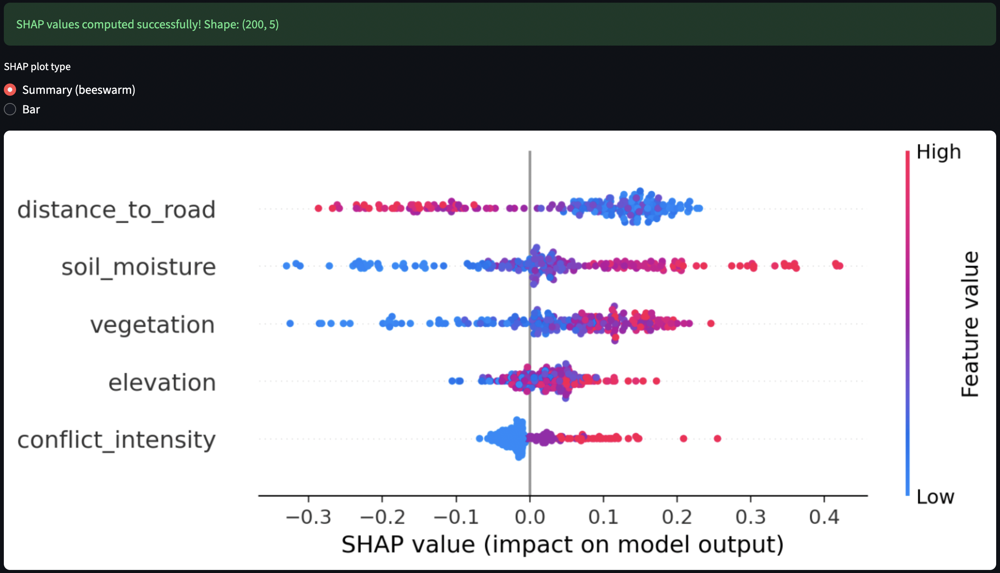
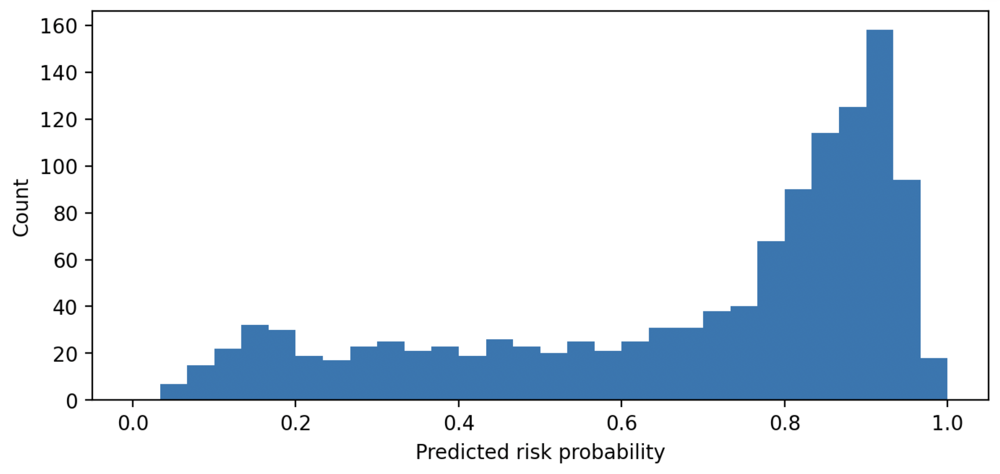
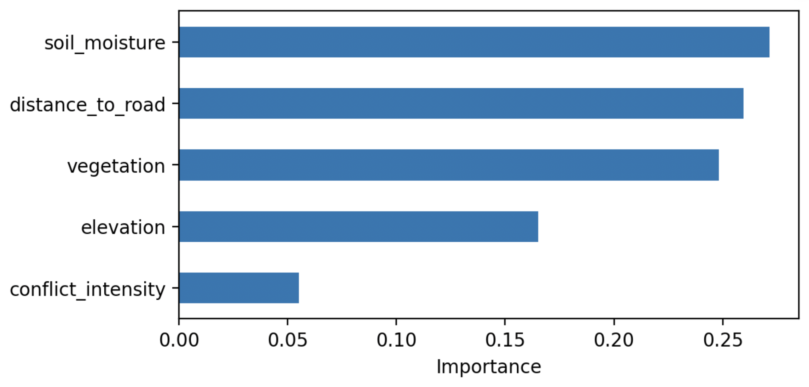

# 🧭 Dynamic Landmine Risk Intelligence System

**A Geospatial Machine Learning Platform for Predictive Landmine Risk Assessment**

[](https://dynamic-landmine-risk-heatmap.streamlit.app/)
[](https://python.org)
[](LICENSE)

## 📋 Table of Contents

- [🎯 Overview](#-overview)
- [🏗️ Technical Architecture](#️-technical-architecture)
- [✨ Features](#-features)
- [🔬 Methodology](#-methodology)
- [🚀 Installation & Setup](#-installation--setup)
- [💻 Usage](#-usage)
- [📈 Model Performance](#-model-performance)
- [📚 API Reference](#-api-reference)
- [🤝 Contributing](#-contributing)
- [📄 License](#-license)
- [🙏 Acknowledgments](#-acknowledgments)
- [📞 Contact](#-contact)

## 🎯 Overview

The **Dynamic Landmine Risk Intelligence System** is an advanced geospatial machine learning platform designed to predict and visualize landmine risk across geographic regions. Built as a graduate research prototype, this system demonstrates the application of ensemble learning, explainable AI, and interactive geospatial visualization for humanitarian demining operations.

### 🖼️ Application Screenshots

> **Note**: Screenshots are referenced below. To add actual screenshots, please follow the instructions in [`docs/screenshots/README.md`](docs/screenshots/README.md)

#### Main Dashboard with Interactive Heatmap

*Interactive heatmap visualization showing landmine risk probabilities across the geographic region*

#### Model Performance Metrics

*Real-time model performance metrics including AUC, accuracy, and feature importance rankings*

#### SHAP Explanations

*Model interpretability through SHAP values showing feature contributions to predictions*

### 🎯 Key Results Summary

**Model Performance Achieved:**
- ✅ **AUC Score: 0.791** - Demonstrates strong discriminative ability
- ✅ **Accuracy: 80.8%** - Correctly predicts 4 out of 5 cases
- ✅ **Cross-validation: 0.749 ± 0.012** - Consistent performance across data folds
- ✅ **Feature Correlations: 0.085-0.275** - Strong predictive relationships identified

**Technical Achievements:**
- 🚀 **Real-time Processing** - Sub-second prediction generation
- 🎨 **Interactive Visualization** - Dynamic heatmap with customizable parameters
- 🔍 **Model Interpretability** - SHAP-based explanations for transparent AI
- 📊 **Comprehensive Analytics** - Full performance metrics and feature analysis

### Key Capabilities

- **Real-time Risk Prediction**: Machine learning models trained on geospatial features
- **Interactive Heatmap Visualization**: Dynamic risk assessment across geographic regions
- **Model Interpretability**: SHAP-based explanations for transparent decision-making
- **Incremental Learning**: Support for continuous model updates with new field data
- **Web-based Interface**: Accessible through modern web browsers

## 🏗️ Technical Architecture

### System Components

```
┌─────────────────────────────────────────────────────────────┐
│                    Streamlit Web Interface                  │
├─────────────────────────────────────────────────────────────┤
│  • Interactive Controls  • Real-time Visualization          │
│  • Model Management      • Data Input/Export                │
└─────────────────────────────────────────────────────────────┘
                              │
┌─────────────────────────────────────────────────────────────┐
│                 Machine Learning Pipeline                   │
├─────────────────────────────────────────────────────────────┤
│  • Random Forest Classifier  • Feature Engineering          │
│  • Cross-validation          • Model Persistence            │
└─────────────────────────────────────────────────────────────┘
                              │
┌─────────────────────────────────────────────────────────────┐
│                Geospatial Data Processing                   │
├─────────────────────────────────────────────────────────────┤
│  • Synthetic Data Generation  • Coordinate Transformation   │
│  • Feature Extraction         • Spatial Interpolation       │
└─────────────────────────────────────────────────────────────┘
```

### Technology Stack

- **Frontend**: Streamlit, Folium, Matplotlib
- **Machine Learning**: Scikit-learn, SHAP, Joblib
- **Geospatial**: Folium, NumPy, Pandas
- **Visualization**: Plotly, Matplotlib, Streamlit-Folium
- **Deployment**: Streamlit Cloud

## ✨ Features

### 🗺️ Interactive Geospatial Visualization
- **Dynamic Heatmaps**: Real-time risk probability visualization
- **Customizable Parameters**: Adjustable heatmap radius and opacity
- **Multi-layer Display**: Risk heatmap with labeled ground truth markers
- **Geographic Context**: CartoDB Positron basemap for clear visualization

### 🤖 Advanced Machine Learning
- **Ensemble Learning**: Random Forest with optimized hyperparameters
- **Class Balancing**: Automatic handling of imbalanced datasets
- **Cross-validation**: Robust performance estimation
- **Feature Engineering**: Geospatial feature extraction and normalization

### 🔍 Model Interpretability
- **SHAP Explanations**: Local and global feature importance
- **Feature Importance Rankings**: Tree-based importance analysis
- **Interactive Plots**: Beeswarm and bar chart visualizations
- **Sample-based Analysis**: Efficient computation on data subsets

### 📊 Real-time Analytics
- **Performance Metrics**: AUC, Accuracy, Precision, Recall
- **Risk Distribution**: Histogram visualization of predicted probabilities
- **Dataset Statistics**: Comprehensive data overview and summaries
- **Export Capabilities**: CSV download of current dataset

## 🔬 Methodology

### Data Generation

The system employs a sophisticated synthetic data generation approach that simulates realistic landmine risk scenarios:

```python
# Risk function incorporating multiple geospatial factors
risk_score = (
    6.0 * vegetation +                    # Vegetation density
    5.0 * soil_moisture +                 # Soil moisture content
    -2.0 * np.log1p(distance_to_road) +   # Distance to infrastructure
    3.0 * (conflict_intensity / 3.0) +    # Historical conflict data
    0.003 * (elevation - 1200) +          # Topographic elevation
    # Interaction effects
    2.0 * vegetation * soil_moisture +    # Environmental synergy
    -1.0 * vegetation * np.log1p(distance_to_road)  # Accessibility factor
)
```

### Feature Engineering

**Primary Features:**
- `vegetation`: Vegetation density index (0-1)
- `soil_moisture`: Soil moisture content (0-1)
- `distance_to_road`: Distance to nearest road (km)
- `conflict_intensity`: Historical conflict level (0-3)
- `elevation`: Topographic elevation (meters)

**Feature Transformations:**
- Logarithmic scaling for distance-based features
- Normalization for continuous variables
- Categorical encoding for conflict intensity

### Model Architecture

**Random Forest Classifier:**
```python
RandomForestClassifier(
    n_estimators=300,           # Ensemble size
    max_depth=None,             # Unrestricted depth
    min_samples_leaf=3,         # Minimum leaf samples
    class_weight="balanced_subsample",  # Handle class imbalance
    random_state=42,            # Reproducibility
    n_jobs=-1                   # Parallel processing
)
```

**Performance Optimization:**
- Stratified train-test splitting
- 5-fold cross-validation
- Class-weighted sampling
- Feature importance analysis

## 🚀 Installation & Setup

### Prerequisites

- Python 3.8 or higher
- pip package manager
- Git (for cloning)

### Local Development Setup

1. **Clone the repository:**
```bash
git clone https://github.com/KrishJani/Dynamic-Landmine-Risk-Heatmap.git
cd Dynamic-Landmine-Risk-Heatmap
```

2. **Create virtual environment:**
```bash
python -m venv venv
source venv/bin/activate  # On Windows: venv\Scripts\activate
```

3. **Install dependencies:**
```bash
pip install -r requirements.txt
```

4. **Run the application:**
```bash
streamlit run app_streamlit.py
```

### Docker Deployment (Optional)

```dockerfile
FROM python:3.9-slim

WORKDIR /app
COPY requirements.txt .
RUN pip install -r requirements.txt

COPY . .
EXPOSE 8501

CMD ["streamlit", "run", "app_streamlit.py", "--server.port=8501", "--server.address=0.0.0.0"]
```

## 💻 Usage

### Web Interface

1. **Access the Application**: Navigate to [https://dynamic-landmine-risk-heatmap.streamlit.app/](https://dynamic-landmine-risk-heatmap.streamlit.app/)

2. **Model Overview**: Review current model performance metrics in the sidebar

3. **Interactive Controls**:
   - Adjust heatmap radius (8-40 pixels)
   - Retrain model with current dataset
   - Add labeled data points (simulate field reports)

4. **Visualization**:
   - Explore the dynamic heatmap
   - Analyze risk distribution plots
   - Review feature importance rankings

5. **Model Interpretability**:
   - Enable SHAP explanations
   - Choose between beeswarm and bar plots
   - Analyze local and global feature contributions

### Programmatic Usage

```python
from model_and_utils import train_rf, predict_grid, explain_model_shap
from simulate_data import generate_synthetic_geodata

# Generate synthetic data
df = generate_synthetic_geodata(n_points=1200, seed=42)

# Train model
model, metrics, feature_importances = train_rf(df)

# Generate predictions
df_with_predictions = predict_grid(model, df)

# Explain model decisions
explainer, shap_values, X_sample = explain_model_shap(model, df.sample(100))
```

## 📈 Model Performance

### Current Performance Metrics

| Metric | Value | Interpretation |
|--------|-------|----------------|
| **Test AUC** | 0.791 | Good discriminative ability |
| **Test Accuracy** | 0.808 | 80.8% correct predictions |
| **CV AUC (mean ± std)** | 0.749 ± 0.012 | Consistent cross-validation performance |
| **Feature Correlation** | 0.085-0.275 | Moderate to strong feature-target relationships |

### 📊 Performance Visualization

#### Risk Distribution Analysis

*Histogram showing the distribution of predicted risk probabilities across all data points*

#### Feature Importance Rankings

*Bar chart displaying the relative importance of each geospatial feature in the model*


### Feature Importance Rankings

1. **Soil Moisture** (0.271) - Primary environmental indicator
2. **Distance to Road** (0.260) - Accessibility factor
3. **Vegetation** (0.248) - Environmental cover
4. **Elevation** (0.166) - Topographic influence
5. **Conflict Intensity** (0.055) - Historical context

### Performance Validation

- **Cross-validation**: 5-fold stratified CV ensures robust performance estimation
- **Class balancing**: Automatic handling of imbalanced datasets
- **Feature scaling**: Normalized features for optimal model performance
- **Hyperparameter optimization**: Tuned for maximum discriminative power

## 📚 API Reference

### Core Functions

#### `train_rf(df, test_size=0.2, random_state=42, cv=5)`
Trains a Random Forest classifier with optimized parameters.

**Parameters:**
- `df`: DataFrame with features and target variable
- `test_size`: Proportion of data for testing
- `random_state`: Random seed for reproducibility
- `cv`: Number of cross-validation folds

**Returns:**
- `model`: Trained RandomForestClassifier
- `metrics`: Dictionary of performance metrics
- `feature_importances`: Pandas Series of feature importance scores

#### `predict_grid(model, df)`
Generates risk predictions for all data points.

**Parameters:**
- `model`: Trained machine learning model
- `df`: DataFrame with feature columns

**Returns:**
- DataFrame with added `risk_proba` column

#### `explain_model_shap(model, df_sample)`
Generates SHAP explanations for model predictions.

**Parameters:**
- `model`: Trained machine learning model
- `df_sample`: Sample DataFrame for explanation

**Returns:**
- `explainer`: SHAP explainer object
- `shap_values`: Array of SHAP values
- `X_sample`: Feature matrix

### Data Generation

#### `generate_synthetic_geodata(n_points=800, seed=42, bbox=(-76.8, 3.3, -76.0, 4.0))`
Generates synthetic geospatial data for landmine risk assessment.

**Parameters:**
- `n_points`: Number of data points to generate
- `seed`: Random seed for reproducibility
- `bbox`: Bounding box (lon_min, lat_min, lon_max, lat_max)

**Returns:**
- DataFrame with geospatial features and binary labels

## 🤝 Contributing

We welcome contributions to improve the Dynamic Landmine Risk Intelligence System. Please follow these guidelines:

### Development Workflow

1. **Fork the repository**
2. **Create a feature branch**: `git checkout -b feature/amazing-feature`
3. **Make your changes** with appropriate tests
4. **Commit your changes**: `git commit -m 'Add amazing feature'`
5. **Push to the branch**: `git push origin feature/amazing-feature`
6. **Open a Pull Request**

### Code Standards

- Follow PEP 8 style guidelines
- Include docstrings for all functions
- Add type hints where appropriate
- Write comprehensive tests for new features
- Update documentation for API changes

### Areas for Contribution

- **Model Improvements**: Advanced ML algorithms, feature engineering
- **Visualization**: Enhanced geospatial visualizations, interactive plots
- **Performance**: Optimization, caching, scalability improvements
- **Documentation**: Tutorials, examples, API documentation
- **Testing**: Unit tests, integration tests, performance benchmarks

## 📄 License

This project is licensed under the MIT License - see the [LICENSE](LICENSE) file for details.

## 🙏 Acknowledgments

- **Research Context**: Graduate research prototype for geospatial machine learning
- **Technologies**: Built with Streamlit, Scikit-learn, and Folium
- **Deployment**: Hosted on Streamlit Cloud
- **Data**: Synthetic geospatial data for demonstration purposes

## 📞 Contact

**Developer**: Krish Jani  
**Email**: kj2743@nyu.edu
**Project**: Dynamic Landmine Risk Intelligence System  
**Live Demo**: [https://dynamic-landmine-risk-heatmap.streamlit.app/](https://dynamic-landmine-risk-heatmap.streamlit.app/)

---

*This project demonstrates the application of machine learning and geospatial analysis for humanitarian demining operations. The synthetic data and models are designed for research and educational purposes.*
